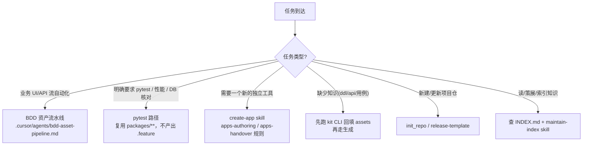

<!-- version: 1.2.0 -->
# AGENTS — 平台总入口（轻量 DM）

> 本文件是"repo as a platform"的**稳定世界观**：只写不常变的分层结构与角色。
> 「当前仓库有哪些具体知识与能力」这类会频繁变化的信息**不在这里**，去读
> [`INDEX.md`](INDEX.md)（平台能力地图）与 [`.cursor/REGISTRY.md`](.cursor/REGISTRY.md)（AI 组件注册表）。
> 若存在 `INDEX.project.md`（试验田 / 下游项目仓的业务资产地图），生成业务测试前一并阅读。

## 1. 六层分层结构（职责边界）

| 层 | 目录 | 职责 | 谁运行 |
| --- | --- | --- | --- |
| 知识层 | `assets/` | 给人和 LLM 阅读、生成测试代码的基础知识（ddl / sql / usecases / testreport / domain-notes）。见 `docs/spec/assets-knowledge-syntax.md`。 | 只读引用 |
| 运行库 | `tuner_testkit/`（PyPI：`tuner-testkit`） | 公共运行时与 CLI（db / logging / api_test / page_test / fake / recorders / dna）。SUT 用 `uv` 锁版本。 | `import tuner_testkit`；`tuner-recorder` 等 scripts |
| 组件层 | `packages/` | **本仓业务资产**（api_objects / page_objects / action_words），不是 kit 运行库。 | 被 import |
| 工具层 | `apps/` | **本仓私有**工具。公共工具在 `tuner_testkit.apps`。见 `docs/spec/apps-authoring-syntax.md`。 | `python -m apps.<name>`（仅项目工具） |
| 数据层 | `data/` | 供测试代码读取的结构化测试数据。 | 被读取 |
| 测试层 | `tests/` | 自动化测试代码（behave `features/` + `pytest/`）。 | behave / pytest |
| 文档层 | `docs/` | 仓库使用说明与规范（`docs/spec/**`）。 | 只读 |

配套：`config/`（环境/数据源）、`.cursor/`（AI 组件，见下）、`artifacts/`·`logs/`（运行产出）。

## 2. 三角色

- **测试工程师**：向 `assets/` 沉淀高置信度的手工经验（SQL / 测试报告 / 业务讲解）；向 `apps/` 用 packages + assets 交给 LLM 按需开发工具。
- **LLM**：读取 `assets/`、`INDEX.md`（及存在时的 `INDEX.project.md`）作为**生成依据**（防幻觉），协助工程师产出测试与工具；维护对应索引与各类资产。
- **MCP**（如 Playwright MCP）：读取被测系统页面/网络，供 LLM 生成 `packages/page_objects`、冻结 `packages/api_objects`。

## 3. AI 组件即"平台后端服务"

`.cursor/**` 下的 rule / skill / agent / hook 相当于传统测试平台后端 service 里的**业务规则与处理逻辑**，需被版本化并对人类可读。

- **想知道当前有哪些规则/技能/编排/钩子、各是什么版本** → 读 [`.cursor/REGISTRY.md`](.cursor/REGISTRY.md)（由 `python -m tuner_testkit.apps.index_ai` 确定性生成）。
- **组件类型判断口诀**：能确定性脚本化就用 **hook/app**，别用 LLM；是约束就用 **rule**；是流程就用 **skill**；要串流程就用 **agent**。

## 4. 任务分诊（中立决策树，无 always-on 强制流程）

拿到任务先判断类型，再选路。**没有任何一条工作流是默认强制的**——BDD 只是能力之一。

- **业务 UI/API 流** → 参见 `.cursor/agents/bdd-asset-pipeline.md`（该编排内部含 BDD 三门禁，仅在此分支生效）。
- **明确 pytest** → 直接写 pytest，复用 `packages/**`，不要为满足分层而硬造 Gherkin。
- **造工具** → `create-app` skill；工具做好按 `apps-handover.mdc` 补交接文档。
- **补知识** → 用 `tuner-dump-ddl`、`tuner-recorder`（合录）、`tuner-api-recorder`、`tuner-page-recorder` 等回填 `assets/` / `packages/api_objects` / `packages/page_objects`，再进入生成。
- **仓库初始化/发布** → `tuner-init scaffold`（骨架 + 依赖 `tuner-testkit` + 一次 `tuner-dna sync`）+ `release-template` skill。下游升 kit：`uv add tuner-testkit==x.y.z` 然后 `tuner-dna sync`，再提交。
- **读/索引知识** → 先查 `INDEX.md`；若存在 `INDEX.project.md` 则一并查。索引维护用 `maintain-index` skill。

## 5. 全程硬约束（跨分支）

- 不得将 token / cookie / Authorization / 密码 / session 等敏感信息写入仓库（含 capture 与 api_objects）。
- 提交遵循 Conventional Commits + 六层 scope，见 `docs/spec/commit-convention.md`（`commit-msg` hook 会校验）。
- DB 只走 `tuner_testkit.db`，日志只走 `tuner_testkit.logging`（见对应 rule）。
- 密钥只放本机 `config/env_local.py` 或环境变量，**任何分支都不得提交**。多套 prd/uat/dev 写在 `env_local.ENVIRONMENTS` 里，用 `python -m tuner_testkit.config use <name>` 切换（或 `TUNER_ENV`；旧名 `ARGON_ENV` 仍可用）。

## 6. 本仓分支约定（平台 + Plane dogfood）

本公开仓同时维护平台 DNA 与一个 **Plane dogfood** 试用场，**不是**把多个被测系统合进 `main`。其它 SUT 在各自项目仓演进，用 `init_repo` 从 `main` 取 DNA。

Dogfood：用开源项目管理软件 [Plane](https://github.com/makeplane/plane) 做本测试仓的可视化，同时用本仓回归 Plane 自身。

| 分支 | 职责 | 谁改 |
| --- | --- | --- |
| `main` | 平台：`tuner_testkit/`、`.cursor/**`、`docs/spec/**`、`INDEX.md` | 框架改动只在这里提交 |
| `plane-dogfood` | `main` + Plane 业务资产（`assets/`、业务 objects/words/features、`INDEX.project.md`） | 业务资产；**不改**平台文件 |

- 只允许 **`main` → `plane-dogfood`** 的 merge。禁止把 dogfood 合回 main。
- 试用中发现框架要改：先在 `main` 改并提交，再 merge 进 `plane-dogfood` 继续试用。
- dogfood 独有路径（`INDEX.project.md`、`config/env_overlay.py`、业务 `assets/` / `api_objects` / features）main 上不存在，因此合入不会对打。
- 项目主数据与业务模型放 `params_project.py` / `models_project.py`（main 上的 `params.py` / `models.py` 只做转出）。
