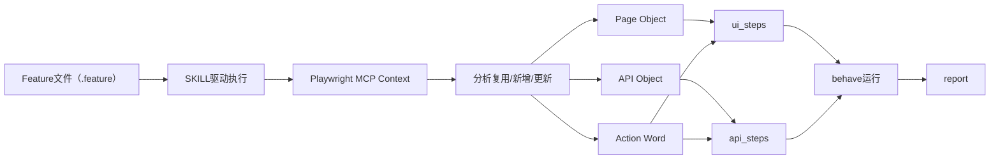

# README

## 快速启动（uv + PowerShell）

> 目标：从零开始创建虚拟环境，并同步本仓库依赖（基于 `pyproject.toml` / `uv.lock`）。

在仓库根目录执行（PowerShell）：

```powershell
uv venv # 创建虚拟环境
uv sync # 同步依赖
```

可选：激活虚拟环境（PowerShell）：

```powershell
.\.venv\Scripts\Activate.ps1
```

---

## AI 自动化测试资产仓库（Examples）- README（纲要）

本仓库用于演示并落地一套 **“测试资产管理 + AI 辅助自动化（Python + behave + Playwright MCP）”** 的工程化方案：非编码测试同学写 `.feature`，AI/工具链执行并沉淀可复用的 **Page Object / API Object**，最终形成可维护、可审计、可扩展的自动化资产库。

> **框架选择**：业务流 UI/API 场景默认走 **behave + Gherkin**。若任务**明确要求 pytest**（常见于性能、数据库核对等），直接用 pytest 实现并复用 `packages/**`，不必强制产出 `.feature` / behave steps。

---

## 目标

- **工程化**：统一目录结构、命名、运行入口、报告产出
- **规范化**：以规范约束 AI 与人工产出，减少腐化
- **替代能力**：将“重复回归、人工核对、脚本维护”逐步替换为可复用资产与可度量流程

---

## 测试资产管理（资产口径）

### 资产来源

当前支持三类来源（第一期）：

- **禅道用例**：可导出为 CSV
- **XMind 用例**：可通过 `xmind2testcase` 等工具转换为 CSV/Markdown
- **运维阶段增量矩阵文档**：按约定格式记录需求/设计/测试点/缺陷矩阵（Markdown/Excel 等）

### 资产落库位置

- `assets/`：存放具体项目的业务知识等资料，外部导入或转换后的“原始用例资产”（CSV/MD/XMind 导出物等）
- `apps/`：存放可独立运行的测试工具，如 `dump_ddl`、`recorder`（HTTP 代理抓包生成 API Objects）
- `packages/`：存放测试代码与资源技术方面的支撑库，如 db、excel、logging、`action_words`、录制的 api/ui objects 等会被测试代码调用的资源
- `docs/`：存放测试代码与资源技术方面的docs

> 原始资产的原则：尽量保持可追溯（保留来源、导出日期、版本），不在导入后随意重写其语义。

---

## 自动化资产（核心：Feature → Context → Objects → Steps）

### 资产分层

- **Feature（业务表达层）**：`tests/features/**/*.feature`
- **Step Definitions（编排层）**：`tests/features/ui_steps/**`、`tests/features/api_steps/**`（薄编排，优先调用 Action Words）
- **Action Words（业务动作层）**：`packages/action_words/**`（DB 造数/断言、API 请求/断言等可独立运行单元；原 data_factory 已迁入此类）
- **Page Objects（UI 资产层）**：`packages/page_objects/**`
- **API Objects（接口资产层）**：`packages/api_objects/**`
- **Packages（通用能力层）**：`packages/**`（db、logging、excel、api_test、config 等）

### 核心工作流（与 `AI自动化仓库.canvas` 对齐）



---

## 仓库规范（Workfiles / Specs）

本仓库通过“规范文件”约束 feature/steps/page/api objects 的边界与写法，作为 AI 的硬约束输入。

### 规范文件清单

- **Gherkin/Feature 规范**：`behave-gerkin-syntax.md`
  - 标签体系、参数化、可自动化性约束、Good/Bad 示例
- **behave steps 规范**：`behave-step-definitions.md`
  - UI/API 分层、复用策略、context 命名空间、hooks 建议、反模式
- **Page Objects 规范（Python + Playwright）**：`page-objects-syntax.md`
  - locator 优先级、组件化、等待策略、flow 层边界、反模式
- **API Objects 规范（路由资产 + 去重 + 脱敏）**：`api-objects-syntax.md`
  - 路由对齐、fingerprint、auth/headers policy、稳定断言/提取、版本策略
- **MCP 执行与上下文沉淀规范**：`bdd-run-gherkin-in-playwrightMCP.md`
  - Run→Capture→Freeze、结构化 capture、脱敏、匹配/生成/更新策略
- **Action Words 规范**：`action-words-syntax.md`
  - 基类契约、Pydantic 入参、cleanup 登记、CLI 独立执行、与 BDD/pytest 集成

---

## Skills 列表（AI 能力清单，按职责拆分）

> 说明：skills 的目标是“把 AI 的写入范围缩小到可审计、可回滚的区域”。

### 1) Feature 类

- **Feature 生成/改写**：从需求/用例资产生成 `.feature`（遵循 `behave-gerkin-syntax.md`）
- **Feature Lint / 评审**：检查结构、标签、可自动化性、步骤粒度；给出改写建议

### 2) 执行类

- **执行 Feature（Playwright MCP）**：按场景运行并保留上下文（遵循 `bdd-run-gherkin-in-playwrightMCP.md`）
- **失败分类（Triage）**：UI/API/环境/脚本四类快速归因（第一期可先人工）

### 3) 资产沉淀类

- **Page Object 维护**：从上下文提取定位候选，按优先级生成/更新 `packages/page_objects/`
- **API Object 固化**：从 capture / `apps.recorder` 归一化/指纹匹配，生成/更新 `packages/api_objects/`（严格脱敏）
- **Action Word 创建/维护**：按 `action-words-syntax.md` 新增或更新 `packages/action_words/**`
- **复用分析**：对比现有 page/api objects / action words，判断“复用/新增/升级版本”

---

## File Structure（示例结构图）

```text
.
├── .cursor/skills/             # AI skills（含 create-action-word 等）
├── apps/                       # 可独立运行的工具（dump_ddl、recorder）
├── assets/                     # 原始用例资产、DDL 等（非 BDD 代码）
│   └── ddl/                    # 表结构 SQL（工具产出）
├── tests/                      # 测试入口
│   ├── features/               # BDD 用例与 steps（behave paths）
│   │   ├── api_steps/
│   │   ├── ui_steps/
│   │   ├── api_environment.py
│   │   └── ui_environment.py
│   └── pytest/                 # 显式 pytest 套件（性能/DB 等）
├── docs/                       # 测试架构说明与 spec
├── packages/                   # 支撑库与自动化资产
│   ├── action_words/           # 业务动作层（db_seed/api_request/...）
│   ├── api_objects/            # API 资产（按路由对齐；含 auth.py）
│   ├── page_objects/           # UI 资产（页面/组件）
│   ├── api_test/               # APIModel 运行框架
│   ├── db/ excel/ logging/     # 通用能力
│   └── tests/                  # packages 单元测试
├── config/                     # 环境配置
├── data/                       # 测试数据（第一期可为空）
└── artifacts/                  # 运行报告/日志产出（可选）
```

---

## 最小上手（第一期建议）

> 这是纲要版；具体命令以你们的 runner 实现为准。

- **写/导入用例资产**：将 CSV/MD 等放入 `assets/`
- **编写 feature**：在 `tests/features/` 新建 `.feature`（遵循 `behave-gerkin-syntax.md`）
- **运行与沉淀**：
  - SKILL 驱动执行场景（Playwright MCP）或 `python -m apps.recorder` 抓包
  - 生成/更新 `packages/page_objects/`、`packages/api_objects/`、`packages/action_words/`
  - 自动/半自动补齐 `tests/features/*_steps/`
- **执行回归**：使用 behave 运行并产出 report（可用 html-pretty formatter）

---

## 度量与替代工作（规划）

- **用例数量**：手工/自动化比例
- **执行次数与收益**：自动化运行次数、发现缺陷/回归拦截次数
- **回归用例集划分**：smoke/critical/regression/slow 分层运行策略

---

## 安全与合规（强制）

- **不得将 token/cookie 等敏感信息写入仓库**（包括 capture 与 api_objects）
- API 资产必须通过 `auth_policy` 声明“需要认证”，凭证只允许运行时注入
